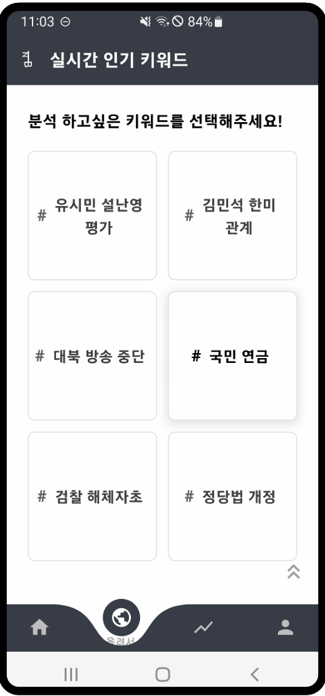
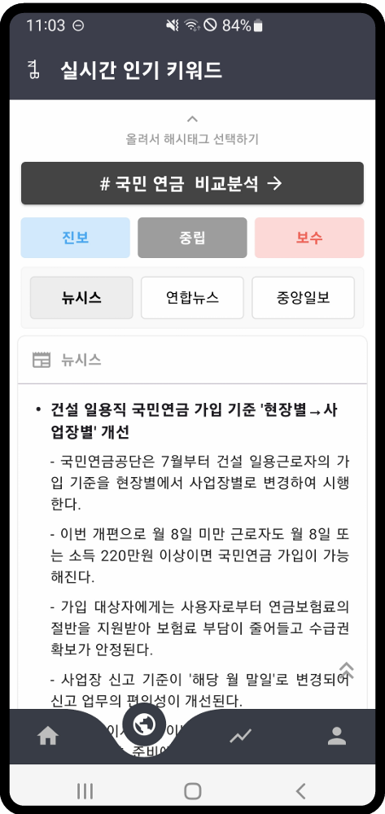
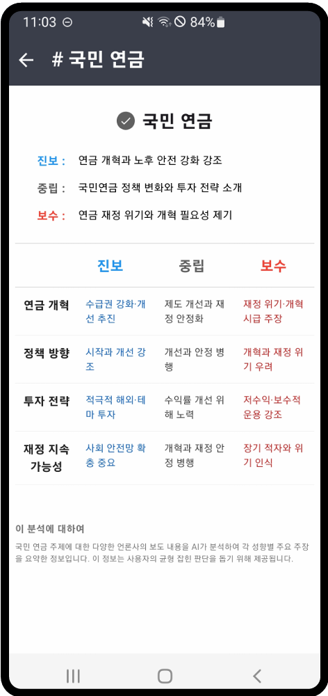
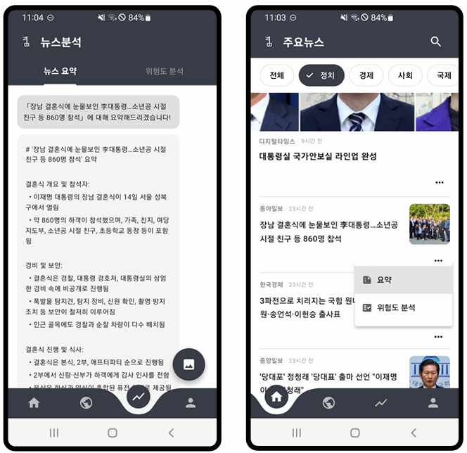
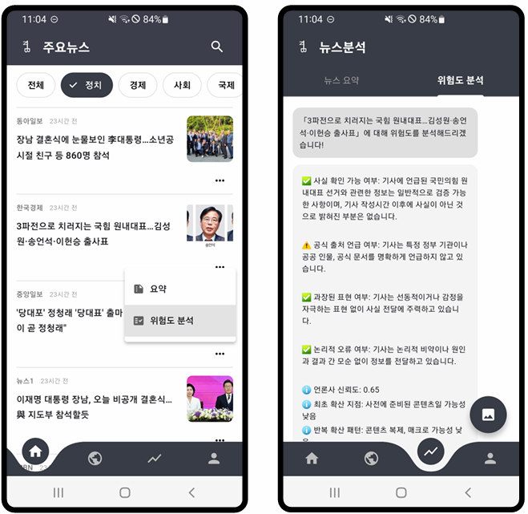
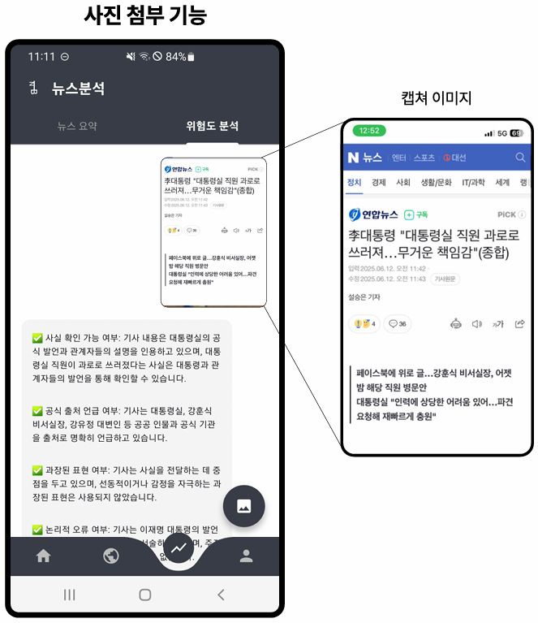

# 📰 News Bar Service

---

## 📌 프로젝트 개요

### ⚠️ **개발 배경**

현대 사회에서 뉴스 플랫폼은 개인화 알고리즘을 통해 사용자가 선호하는 정보만 반복적으로 노출합니다. 이는 정보 접근의 편리성을 높이는 한편, **확증 편향(Confirmation Bias)** 을 심화시켜 사회적 양극화와 갈등을 고착화시키는 문제를 초래하고 있습니다.

또한, 출처가 불분명하거나 가짜뉴스의 가능성이 있는 정보가 SNS와 인터넷 상에서 무분별하게 유통되고 있으며, 사용자는 이를 진실로 인식하기 쉬운 구조적 문제를 가지고 있습니다.

---

### 💡 **개발 목적**

✅ **정치 뉴스의 성향(진보/중립/보수) 분류**  
✅ 동일 이슈에 대한 **각 성향별 기사 요약·비교·분석**  
✅ **가짜뉴스 위험도 분석**을 통해 신뢰도 높은 기사만 제공

이를 통해 사용자는

- **균형 잡힌 정보 소비 경험**을 얻고
- **비판적 사고 능력**을 강화하며
- **건강한 공론장 형성**에 기여할 수 있습니다.

---

### 🔬 **핵심 아이디어**

> **“다양한 관점을 한눈에 비교하고, 허위 정보 위험도를 분석하여, 사용자가 더 비판적이고 균형 잡힌 시각으로 뉴스를 소비할 수 있도록 돕는 서비스”**

---

## ✨ **주요 기능 상세**

### 🔍 1. 실시간 핫토픽 6개 추출

네이버 정치 헤드라인 기사에서 현재 이슈가 되는 **핫토픽 키워드 6개**를 실시간으로 추출합니다.  
이를 통해 사용자는 현재 정치권의 흐름을 한눈에 파악할 수 있습니다.

---

### 📰 2. 핫토픽에 대한 정치 성향별 기사 요약본 제공

각 핫토픽 키워드에 대해  
✅ **진보**  
✅ **중립**  
✅ **보수**  
정치 성향별 기사들을 수집하고,  
각 기사의 **핵심 내용을 요약**하여 제공합니다.
- 기사 요약은 **GPT-4.1-nano** 모델을 프롬프트 엔지니어링 하여 제공합니다.

---

### 📊 3. 핫토픽 기사 비교 분석

같은 이슈에 대한 **정치 성향별 시각 차이를 구조화·시각화**하여,  
사용자가 다양한 관점을 쉽게 비교 분석할 수 있도록 지원합니다.
- 기사 비교 분석은 **GPT-4.1-nano** 모델을 프롬프트 엔지니어링 하여 제공합니다.

---

### 📝 4. 개별 기사 요약 기능

플랫폼에 업로드된 개별 기사에 대해,  
AI를 활용하여 **간결하고 정확한 요약본**을 제공합니다.

---

### 🛡️ 5. 개별 기사 위험도 분석 기능

플랫폼에 업로드된 개별 기사에 대해  
✅ **언론사 신뢰도**  
✅ **출처 명확성**  
✅ **논리적 오류, 과장 여부**  
✅ **확산 패턴**  
등을 종합적으로 분석하여, **가짜뉴스 위험도 평가** 결과를 제공합니다.

---

### 🖼️ 6. 외부 기사 스크린샷 기반 검색 및 요약·위험도 분석

플랫폼 외부의 기사도  
✅ **스크린샷 이미지 업로드**를 통해 텍스트를 추출(OCR)하고,  
✅ 해당 기사에 대한 **요약** 및 **위험도 분석**을 진행할 수 있습니다.

---

## ⚠️ 실행 불가 안내

본 프로젝트는 연구 및 결과 공유 목적의 레포지토리입니다.  
정치 성향 분류 모델(KoBigBird fine-tuned model) 및 일부 데이터셋은 라이선스, 용량 문제로 업로드되어 있지 않습니다.

---

## 🔗 데이터 및 모델 학습 출처

- [KoPolitic Benchmark Dataset](https://github.com/Kdavid2355/KoPolitic-Benchmark-Dataset)  
  → 이 데이터셋을 활용하여 Kobigbird 모델을 파인튜닝하여 정치 성향 분류 모델 학습.

---

## 🙌 팀원

세종대학교 지능기전공학부 2025-1 캡스톤디자인 6조  
최열음, 정우진, 한상준, 최연수

---

## 📄 라이선스

이 프로젝트는 MIT 라이선스 하에 배포됩니다. 자세한 내용은 [LICENSE](./LICENSE)를 참고하세요.
